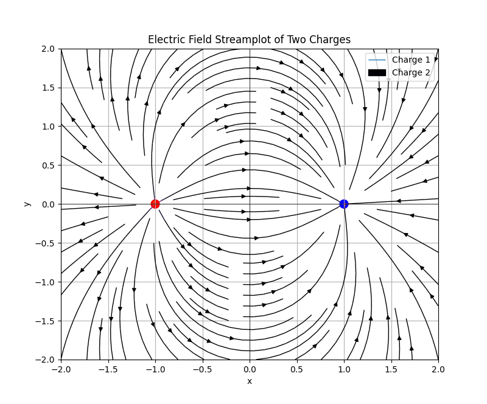

These are my notes on the book *Numerical Methods in Python* by by Alex Gezerlis. These notes are subject to continuous changes.

# Chapter 1: Idiomatic Python

> Untested code is wrong code.


#### Printing all values in the same line
```python
for i in range(1,15,1): # range(begin,end, step)
	print(i**0.01, end=" ")
```
- The command `end=" "` prints the whole output in a single line. We can also use `end="\t"` or `end="\n"`
- The `range` function only works with integer step size!

## Data Structures
### Lists 
Lists are a container of elements. They are mutable.

- **Caution** Renaming a list and changing it will also change the original list.
```python
xs = [1,2,3]
xs = ys
ys.append(10)
print(xs)
```
	Output: [1,2,3,10]

#### Example: Creating lists
```python
import math
xs=[]  
for i in range(20):  
    xs.append(sin(i*math.pi/10))  
print(f"xs={xs}")
```
#### Example: Mutating Lists
Lists are mutable.
```python
xs = [1,2,3]
xs[0]=100
print("xs[0]=100")
print(f"xs={xs}")
```

To reverse a list we need to do some stuffs.
#### Example: Reversing a list
```python
import math

# GENERATING A LIST
xs=[]  
for i in range(20):  
    xs.append(sin(i*math.pi/10))  
print(f"xs={xs}")

# REVERSING THE GENERATED LIST
for i in range(20):
    temp = xs[::-1] # [start:stop:step]
xs = temp
print(f"Reversed xs={xs}")
```
We can also add lists using the `+` operator

```python
xs = 10*[0]  
ys = 10*[math.pi]  
zs = xs + ys  
print(zs)
```

To get the length and sum of the list we use the `len` and `sum` function respectively
```python
xs = [1,2,3]
print(len(xs))
sum((xs))
```

### List slicing
To get a new list from a old one you have to *slice* it. 
**Caution:** *When you slice you get a copy of the original list* That is, when you name a list something else then mutate it it will mutate the original list. But if you slice it then you get a copy of the original list.

- To slice a whole copy of the list such that changing the copy will not change the original,
```python
xs = [1,2,4]
ys = xs[:]
```

- Use the colon operator `:` will get the entire list
```python
print("Upto but not including 5")  
xs[2:5]
```
Manipulating the steps in the list. 
```python
## Slicing with steps  
xs[::2]
```
#### List slicing syntax
```
a = [1,3,4]
a[begin:end:step]
```
- `a[1:3]` will give elements [1,3).

**Note:** The `range()` function works similarly to lists but uses commas `,` instead of colons `:`.
```
range(begin,end,step)
```

## Tuples
Tuples can be thought of as immutable lists.
`tuple1 = (a,b,c)`
- They can be called like the array e.g., `tuple1[0]` will output `a`.
- We can omit the parentheses for tuples
```python
tuple1 = 1,2,3
```
	Output: (1,2,3)
```python
x = 1; y =2; z = 3
x,y,z
```
	Output: (1,2,3)

Tuples can be used to return multiple values from a function
```python
def foo(a, b):  
    z = a + b  
    return a,b,z  
foo(1,2)
```


## Strings
Strings can also be viewed as immutable lists. They are sequences of characters, e.g., `name='Marry'`
- We can concatenate two strings using the `+` operator.

#### Example: Reversing a string
```python
name = "Marry"

## Reversing strings
temp = ''
length = len(name)
for i in range(len(name)):
    if i==0:
        i = -1
    else:
        i = -i-1
    temp = temp+(name[i])
print(name)
print(temp)
```


#### The `format()` function
The `format()` function converts other data types to strings.

- Syntax
```python
x = 1
y = 2
"{0} {1}".format(x,y)
```
	Output: '1 2'

#### Example: Formatting Booleans to strings  
```python
A = True; B = False
"{0} {1}".format(A,B)
```

#### Example: Converting a list of numbers to string using the `format` function
```python
# Generate a list
import random as rd  
xs = []  
rd.seed(100)  
for i in range(20):  
    xs.append(rd.randint(0, 100))  
print(f"Generated list: {xs}")

# Converting a list to string
ys = ""
for i in range(len(xs)):
    if i== len(xs)-1:
        ys += str({i})
    else:
        ys += str({i})+', '
# print(ys)


ys = ys.format(xs[0],xs[1],xs[2],xs[3],xs[4],xs[5],xs[6],xs[7],xs[8],xs[9],xs[10],xs[11],xs[12],xs[13],xs[14],xs[15],xs[16],xs[17],xs[18],xs[19])

print(ys)

```

A better way to format a list of numbers to strings.

#### Example: Converting a list of numbers to string using the `format` function 2
```python
# Generating a list of numbers
import random as rd  
xs = []  
rd.seed(100)  
for i in range(20):  
    xs.append(rd.randint(0, 100))  
print("Generated list: ", xs)

# Converting the list of numbers to strings
ys = ""
for i in range(len(xs)):
    if i == len(xs)-1:
        ys += str(xs[i])
    else:
        ys += str(xs[i])+',' 
print(ys)

```

We can control the precision of the decimals using the `format()` function as well. 

```python
x = 3.1; y = 4
"{0:1.15}{1}".format(x,y)
```

#### Example: Precision controlling $\pi$ to 15 digits
```python
import math
π = math.pi
"π approximation to 15 digits: {0:1.15f}".format(π)
```

This will output the value of `x` with precision of 15 decimal places.
- **Note:** We use the colon operator `:` to specify the number of decimal places.

### f strings
The syntax for f strings,
```python
a = 1; b = 2
print("a = {a}, b = {b}")
```
### Dictionaries
A dictionary is an associative array containing key value pairs.

```python
myDic = {
    'a': 1,
    'b': 2,
    'c': 3
}
```
```python
myDic['c']
```
	Output: 3

Another way to create dict is through the following syntax
```python
better_dic: dict = {'a':1,'b':2, 'c':3 }
```
This is more powerful because we can make multi valued dictionaries with it.
```python
com_dic: dict = {0:['a','b'], 1:['c', 'd']}
```
This is another way of declaring stuffs like `dict` `list` etc.

There are 11 methods that can be used in python dictionaries.

##### Method 1: `values()`
This outputs all the values of a key value paired dictionary.
```python
myDic = {
    'a': 1,
    'b': 2,
    'c': 3
}

print(myDic.values())
```

#### Method 2: `items()`
This prints the whole dictionary with all its key value pairs
```python
dic = {'a':1, 'b':2, 'c':3}
print(dic.items())
```
	output: dict_items([('a', 1), ('b', 2), ('c', 3)])

#### Method 3: `keys()`
`keys()` does the exact opposite of the `values()` method.
```python
dic = {'a':1, 'b':2, 'c':3}
print(dic.keys())
```
	output: dict_keys(['a', 'b', 'c'])

#### Method 3: `pop()`
`pop()` allows us to remove a specific entry by referencing its key.
```python
dic = {'a':1, 'b':2, 'c':3}
dic.pop('a')
print(dic)
```
	output: {'b': 2, 'c': 3}
```python
dic = {'a':1, 'b':2, 'c':3}
print(dic.pop('a'))

```
	output: 1

#### Method 4: `popitem()`
`popitem()` removes the last item from our dictionary
```python
dic = {'a':1, 'b':2, 'c':3}
dic.popitem()
print(dic)
```
	output: {'a': 1, 'b': 2}

#### Method 5: `copy()`
Through `copy()` method we can create a copy of an existing dictionary
```python
another_dic: dict = {0:['a','b'], 1:['c','d']}
my_copy = another_dic.copy()
print(my_copy)
```

We can use the `id` method to check the memory address of the lists to see they are indeed different.
```python
print(id(another_dic),id(my_copy))
```
**Warning:** Python uses shallow copy like lists, changing the copy will change the source.
#### Method 6:   `get()`
The `get()` function is used to get a particular value as output.
```python
myDic = {
    'a': 1,
    'b': 2,
    'c': 3
}
print(myDic.get('a'))
```
	output: 1
If the key is out of range we will get a `None` output as default. We can change it to a specific error message if we like.
```python

myDic = {
    'a': 1,
    'b': 2,
    'c': 3
}
print(myDic.get('z','Missing!'))
```
	output: Missing!

#### Method 7: `setdefault()`
Similar to the `get()` method, it tries to grab a key value pair, *but if that key value pair doesn't exist `setdefault()` will create it*.
```python
myDic = {
    'a': 1,
    'b': 2,
    'c': 3
}
print(myDic.setdefault('z', 100))
print(myDic)
```
	output: 100
			{'a': 1, 'b': 2, 'c': 3, 'z': 100}


#### Method 8: `clear()`
This clears the dictionary making it empty
```python
myDic = {
    'a': 1,
    'b': 2,
    'c': 3
}
print(myDic.setdefault('z', 100))
print(myDic.clear())
```
	output: {}

#### Method 9: `fromkeys()`
Transforms a list to a dictionary

#### Example: Dictionary from list with `None` as the placeholder for keys
```python
people: list[str] = ["John", "Jane", "Joe"]
users: dict = dict.fromkeys(people)
print(users)
```
	output: {'John': None, 'Jane': None, 'Joe': None}

#### Example:  Dictionary from list with a string as the placeholder for key
```python
people: list[str] = ["John", "Jane", "Joe"]

users: dict = dict.fromkeys(people,'Unknown')
print(users)
```
	output: {'John': 'Unknown', 'Jane': 'Unknown', 'Joe': 'Unknown'}

#### Method 10: `items()`
To get the keys and values of a dictionary.
```python
users: dict ={0: "Mike", 1: "Bob", 2: "Alice"}
for k,v in users.items():
    print(k,v)
```
	output: 0 Mike
			1 Bob
			2 Alice

#### Method 11: `update()`
Using `update()` we can expand our dictionary.
```python
users: dict ={0: "Mike", 1: "Bob", 2: "Alice"}

users.update({3: "John"})
print(users)
```
	output: {0: 'Mike', 1: 'Bob', 2: 'Alice', 3: 'John'}

If you input a key value pair that already exists it will update to the most recent key value pair and the older one will be removed.

##### Example: Clashing keys
```python
users: dict ={0: "Mike", 1: "Bob", 2: "Alice"}

users.update({1: "John"})
print(users)
```
	output: {0: 'Mike', 1: 'John', 2: 'Alice'}

We can also update our dictionary using a pipeline `|`.

```python
users: dict ={0: "Mike", 1: "Bob", 2: "Alice"}

users.update({1: "John"})
print(users | {4: "Scar", 5: "Tom"})
```
	output: {0: 'Mike', 1: 'John', 2: 'Alice', 4: 'Scar', 5: 'Tom'}

We can also do in place assignment using `|=` to assign values to our dictionary. This is the newer version of `update()`
```python
users: dict ={0: "Mike", 1: "Bob", 2: "Alice"}
users |= {'name': 'John', 'age': 30, 'city': 'New York'}
print(users)
```
	output: {0: 'Mike',
			 1: 'Bob',
			 2: 'Alice',
			 'name': 'John',
			 'age': 30,
			 'city': 'New York'}


#### Python `enumerate` function
The `enumerate()` function is used to create pairing.

#### Example:
```python
import numpy as np
t = np.linspace(0, 10, 10)
y = np.sin(t)

for t, y in enumerate(y):
    print(t, y)
```

#### Example: 
```python
names: list[str]= ["John", "Scar", "Michael","Jessica","Mary","David","Sarah","Emily","Daniel","Olivia"]

profile: dict[str,str] = {}
for i,names in enumerate(names):
    profile |= {names:i}
print(profile)
```
	output: {'John': 0, 'Scar': 1, 'Michael': 2, 'Jessica': 3, 'Mary': 4, 'David': 5, 'Sarah': 6, 'Emily': 7, 'Daniel': 8, 'Olivia': 9}

### The `reversed()` function

```python
xs = [1,2,3]
for i in reversed(xs):
	print(i)
```


### User defined functions


### Anonymous functions `lambda`

In python we can create throw-away functions using the `lambda`.

```python
f = lambda x: x + 4
```

These are helpful for creating one time functions.

##### Example:
Suppose we wish to put the linear combination of `fa(x)` and `fb(x)` but we do not know the parameters `a` and `b` for the expression `a*fa(x)+b*fb(x)` and the `der()` function only accepts functions. Without modifying the function or creating a new function we can use the `lambda` function to get the job done.

```python
# Problem: 1.4

## Defining a function that is creates a linear combination of two other functions

def fa(x):
    return x+1

def fb(x):
    return x+7

def fc(x,a,b):
    return a*fa(x) + b*fb(x)

def der(f,x,h=0.01):
    return (f(x+h)-f(x))/h

print(der(lambda x:fc(x,1,1),1))
```


## Core-Python Idioms
We now want to use a syntax that makes the code more concise and straightforward.

### List comprehensions
For one list:

`[i**2 for i in range(30)]`

For two lists use the `zip()` function

#### Example: Iterating through two lists
```python
xs = np.random.random(100)
ys = np.random.random(100)

[x*y for x,y in zip(xs,ys)]
```

#### Example: Three lists
```python
a = [1,2,3,4,5]
b = ['a','b','c','d']
c = ['Scar', 'John']

list(zip(a,b,c))
```
	output: [(1, 'a', 'Scar'), (2, 'b', 'John')]

#### Example: `zip` function creates an ordered pair only
```python
xs = [1,2,3,4,5]
ys = [4,3,6,0,9]

for i,j in zip(xs,ys):
    if i==j:
        print(True)
    else:
        print(False)
```
	output: False
			 False
			 False
			 False
			 False

- To see why consider,
```python
xs = [1,2,3,4,5]
ys = [4,3,6,0,9]

list(zip(xs,ys))
```
	output: [(1, 4), (2, 3), (3, 6), (4, 0), (5, 9)]
- There is no pair `(i,j)` where `i==j`.

### Idiomatically working with Dictionaries

Use the `items()` method.

#### Example: 
```python
names: dict[int,str] = {1:'Sarah', 2:'John', 3:'James', 4:'Mary'}

names_list = [(key,value) for key, value in names.items()]
names_tuple =  tuple((key,value) for key, value in names.items())

print("names_list: ", names_list)
print("names_tuple: ", names_tuple)
```

### Exception Handling
#### 1. `assert`
##### Example: Using the `assert` keyword
```python
x = int(input("Enter a number: "))
y = int(input("Enter another number: "))

assert y != 0, "Cannot divide by zero"

print(x/y)
```

It can also be used in if-else control flows.

#### 2. `break`
When you want to exit out of a loop prematurely, you use the `break` keyword.

##### Example
```python
x = [i for i in range(5)]
y = [i+i for i in range(5,0,-1)]

for i in range(len(x)):
    for j in range(len(y)):
        if x[j] == 0:
            print("Cannot divide by zero")
        elif x[i]==x[j]:
            print(f"{x[i]} is equal to {x[j]}")
            break
        elif x[i]==x[j]:
            print(x[i]/0) # Division by zero
```
	output: Cannot divide by zero
			Cannot divide by zero
			1 is equal to 1
			Cannot divide by zero
			2 is equal to 2
			Cannot divide by zero
			3 is equal to 3
			Cannot divide by zero
			4 is equal to 4

- We divided by zero after the `break` yet it doesn't get there because the `break` keyword breaks the loop.

## Basic Plotting with matplotlib

#### Example:
```python
import matplotlib.pyplot as plt
import numpy as np

def Plot(xs, ys, dxs, dys):
    plt.xlabel("x", fontsize=14)
    plt.ylabel("f(x)", fontsize=14)
    plt.plot(xs, ys, 'r--', label="$f(x)$")
    plt.plot(dxs, dys, 'b--^', label="$g(x)$")
    plt.errorbar(dxs, dys, dyerrs, fmt='ko', label="With error")
    plt.legend()
    plt.grid(True)
    plt.show()

xs = [0.1*i for i in range(60)]
ys = [x**2 for x in xs]
dxs = [i for i in range(7)]
dys = [x**1.8 -0.5 for x in dxs]
dyerrs = [0.1*np.abs(y) for y in dys]

Plot(xs, ys, dxs, dys)
```

### Arguments of the `plot()` function 

```python
plt.plot(x_values, y_values, 'plotStyle', label='Function')
```

- In the third call to `plot()` is a *format string* that specifies the style of the plot. 
##### Example:
| Character | Color   |
| --------- | ------- |
| 'b'       | blue    |
| 'g'       | green   |
| 'r'       | red     |
| 'c'       | cyan    |
| 'm'       | megenta |
| 'y'       | yellow  |
| 'k'       | black   |
| 'w'       | white   |

| Character | Description         |
| --------- | ------------------- |
| '-'       | solid line style    |
| '--'      | dashed line style   |
| '-.'      | dash-dot line style |
| ':'       | dotted line style   |
| 'o'       | circle marker       |
| 's'       | square markerq      |
| 'D'       | diamond marker      |
| '^'       | triangle up marker  |

The forth argument is also a *format string* that specifies the label of the function plotted. We can use the `plt.legend()` after this to get legends.

### Error bars

```python
plt.errorbar(dxs, dys, dyerrs, fmt='ko', label="With error")
```

where `dyerrs` is specified outside the function in that example.
```python
dyerrs = [0.1*np.abs(y) for y in dys]
```

### Latex-like equations in plots 

```python
plt.plot(x,y,label="$x_i$")
```

### Specifying which values are displayed 

- We can specify which values are displayed via `xlim()` and `ylim()`.
- We could also employ a log-scale for one or both axes using `xscale()` or `yscale()`.

## Numpy idioms

We can use the built in zip function to step through lists in parallel. 

```python
def f(x):
    return x**2 - 2

ws = [1,2,3,4,5,6,7,8,9,10]
xs = [0.1,0.2,0.3,0.4,0.5,0.6,0.7,0.8,0.9,1.0]

c = [w*f(x) for w,x in zip(ws,xs)]
print(c)
```

Almost always python lists are of homogeneous type. So we can do the tasks more efficiently using a fixed-length homogeneous container.

This is where `numpy` comes in.

Numpy also allows us, for the most part, to avoid writing loops.

**Numpy arrays are row major similar to C programming language.**

### One-dimensional arrays

One-dimensional arrays are direct replacements for lists. We can make an one-dimensional array using the `array` function in numpy.

```python
some_list = [1,2,3,4,5,6]
A  = np.array(some_list)
```

or,

```python
ys = np.array([1,2,3,4,5,6])
```

The `array()` function creates an *array object*. 

- If you want to see how many elements are in the array `ys`, use the `size` attribute.
```python
ys.size
```
- To check the data type of an array in numpy use the `dtype` attribute
```python
ys.dtype
```
- We can also specify the data type when creating a numpy array
```python
ys = np.array([1,2,3,4,5], dtype=np.float32)
```

- To get the dimensions of an array like you would get for matrix in linear algebra use the `shape` attribute

#### Common numpy attributes
| Attribute | Description                                      |
| --------- | ------------------------------------------------ |
| `dtype`   | Data type of array elements                      |
| `ndim`    | Number of columns in the array                   |
| `shape`   | Tuple with number of elements for each dimension |
| `size`    | Total number of elements                         |

To create containers with predefined size we can use `np.zeros()` or `np.ones()`, e.g., `np.zeros(5)`, `np.zeros((5,5))`.

We can work with float arguments using `np.arange()` unlike the built-in `range()` function. However, it is better to use the `np.linspace()` function.
```python
# syntax for linspace
np.linspace(min_, max_,steps)
```

There is also the `np.logspace()` function that creates logarithmically spaced grid points. 

```python
np.logspace(1, 10, 10)
```
	output: array([1.e+01, 1.e+02, 1.e+03, 1.e+04, 1.e+05, 1.e+06, 1.e+07, 1.e+08,
       1.e+09, 1.e+10])


### Copying in numpy

*Python arrays as well as numpy arrays use shallow-copy*

To do a deep-copy use `np.copy()` function.

```python
A = np.random.random(10)
B = np.copy(A[::-1])
B[0] = 10
print(A)
print('------)
print(B)
```

### Broadcasting

Arrays, unlike lists, can be used to *broadcast* numbers onto many slots. 

List slicing in numpy cannot be used to copy arrays *but* it can be used to *broadcast a slice or an element of the array to itself*. This syntax is known as an *everything slice*.
```python
A = np.random.random(10)
A*A[::-1]
print(A)
```

By default, numpy broadcasts all its arrays. This ability to carry out batch operations on all elements of an array is called **vectorization**.

##### Example: The dot product
```python
np.sum(xs*ys) # Vectorization
```

You can also carry out other operations with arrays that wouldn't be possible with matrices or vectors like `1/np.array([1,2,3])` thanks to broadcasting.

### Other useful functions

- `np.where()` helps you to find specific indices where a coordination is met, e.g., `np.where(2==xs)`
- `np.sum()` sums all the elements of any N-dimensional array.
- `np.argmax()` and `np.argmin()` returns the maximum and minimum value of an array respectively.
- `np.transpose()` transposes the array `A`. We can also use the shorthand `A.T` to get the same result.
```python
import numpy as np
np.random.seed(12)

A = np.random.random((3,3))

print(A.T)
```

- The `reshape()` function in numpy reshapes the array to the specified dimension

```python
xs = np.array(([1,2],
              [3,4],
              [5,6]))
print(xs.reshape(6,1))
```
	output: array([[1],
       [2],
       [3],
       [4],
       [5],
       [6]])

##### Useful functions for 2 or more dimensional arrays

- `np.diag()` outputs the diagonal matrix
- `np.tril()` and `np.triu()` to get lower triangle and upper triangle of an array respectively.

One of the most important function is the `np.meshgrid()` function which takes two vectors and returns a coordinate matrix. 

- `np.fill_diagonal()` is helpful to update an array that you already created.
- `np.trace()` is used to find the trace of a matrix.

#### Multiplying matrices

We can multiply matrices using the `@` infix operator.

##### Example: Matrix multiplication
```python
import numpy as np
np.random.seed(12)

A = np.random.random((3,3))
B = np.random.random((3,1))

print(A@B)
```
	output: [[0.39079047]
	 [0.63420792]
	 [0.71306332]]

#### Looping in Numpy

We can loop over rows and columns in numpy

```python
import numpy as np
np.random.seed(12)

A = np.random.random((3,3))
B = np.random.random((3,1))

# Loop over the rows
print("Looping over the rows")
for row in A:
	print(row)

# Looping over columns
print("Looping over columns")
for columns in B.T:
	print(columns)

```
	output: 
	Looping over the rows
	[0.15416284 0.7400497  0.26331502]
	[0.53373939 0.01457496 0.91874701]
	[0.90071485 0.03342143 0.95694934]
	Looping over columns
	[0.13720932 0.28382835 0.60608318]

### Inner and outer product

For inner and outer product we use `np.inner()` and `np.outer()` function respectively.

##### Example: Inner and outer product demo
```python
import numpy as np
np.random.seed(12)

A = np.random.random((2,2))
B = np.random.random((2,2))

print(f"Matrix A is: \n {A}")
print('----------------------------------------')
print(f"Matrix B is: \n {B}")
print('----------------------------------------')

innerProduct = np.inner(A,B)
print(f"Inner product of A and B is:\n {innerProduct}")
print('----------------------------------------')

outerProduct = np.outer(A,B)
print(f"Outer product of A and B is: \n {outerProduct}")
```
	output: Matrix A is: 
		 [[0.15416284 0.7400497 ]
		 [0.26331502 0.53373939]]
		----------------------------------------
		Matrix B is: 
		 [[0.01457496 0.91874701]
		 [0.90071485 0.03342143]]
		----------------------------------------
		Inner product of A and B is:
		 [[0.68216536 0.16359028]
		 [0.49420928 0.25501008]]
		----------------------------------------
		Outer product of A and B is: 
		 [[0.00224692 0.14163665 0.13885676 0.00515234]
		 [0.0107862  0.67991844 0.66657375 0.02473352]
		 [0.00383781 0.24191988 0.23717175 0.00880036]
		 [0.00777923 0.49037147 0.480747   0.01783833]]

##### Example: Outer product of $n\times 1$ and an $1\times n$ matrix

```python
import numpy as np
np.random.seed(10)

A = np.random.random((3,1))
B = np.random.random((1,3))

C = np.outer(A,B)

print(C)
```
	output: [[0.57756789 0.38450875 0.17339029]
	 [0.01553914 0.01034499 0.00466497]
	 [0.47447826 0.31587809 0.142442  ]]

Usually the `np.dot()` function and `@` infix operator does the job of inner and outer product respectively.

### Specifying axis

We can specify whether we want a row-wise or column-wise operation by specifying an additional attribute `axis` to all the functions above.

- Setting `axis=0`, you operate across rows (column-wise).
- Setting `axis=1` you operate across columns (row-wise)

## Project: Visualizing Electric Field

### ChatGPT code:

```python
import numpy as np

import matplotlib.pyplot as plt

  

# Constants

k = 8.99e9 # N·m²/C² (Coulomb's constant)

  

# Charge positions and values

q1, q2 = 1e-9, -1e-9 # Charge values (in Coulombs)

x1, y1 = -1, 0 # Position of charge 1

x2, y2 = 1, 0 # Position of charge 2

  

# Define a grid

x = np.linspace(-2, 2, 100)

y = np.linspace(-2, 2, 100)

X, Y = np.meshgrid(x, y)

  

# Define the electric field components

def E_field(q, xq, yq, X, Y):

	Rx = X - xq

	Ry = Y - yq

	R = np.sqrt(Rx**2 + Ry**2)

	Ex = k * q * Rx / R**3

	Ey = k * q * Ry / R**3

	return Ex, Ey

# Electric field due to charge 1

Ex1, Ey1 = E_field(q1, x1, y1, X, Y)

  

# Electric field due to charge 2

Ex2, Ey2 = E_field(q2, x2, y2, X, Y)

  

# Total electric field

Ex = Ex1 + Ex2

Ey = Ey1 + Ey2

  

# Plot the streamlines

plt.figure(figsize=(8, 8))

plt.streamplot(X, Y, Ex, Ey, color=np.sqrt(Ex**2 + Ey**2), cmap='inferno', linewidth=1)

  

# Add the charges

plt.scatter([x1, x2], [y1, y2], c=['red', 'blue'], s=100, label=['q1', 'q2'])


# Display the plot

plt.title('Electric Field Streamplot of Two Charges')

plt.xlabel('x')

plt.ylabel('y')

plt.axhline(0, color='black', lw=0.5)

plt.axvline(0, color='black', lw=0.5)

plt.grid(True)

plt.legend(['Charge 1', 'Charge 2'])

plt.show()
```
**Output:**


#### Steps

#### Steps:

1. Define constant $k=9\times 10^{9}$
2.  Define the values of $q_{1}$ and $q_{2}$.
3. Define the position vectors of $q_{1}$ and $q_{2}$ as `x1,y1` and `x2,y2`.
4. Define the grid x-y and get `meshgrid` `X,Y`
5. Calculate the electric field
	1. get $q$
	2. get position vector `X-xq` and `Y-yq` for $q$
	3. get $\mid \vec{r}\mid$ as `R`, 
	4. **Note:** `Rx` is the $\hat{x}$ and `Ry` the $\hat{y}$.
	5. get `Ey` and `Ex`
	6. return `Ex`, `Ey`
6. Repeat 5 for $q_{1}$ and $q_{2}$
7. Get $E_{\text{net},x}$ and $E_{{\text{net}, y}}$
8. Plot `stramplot` 